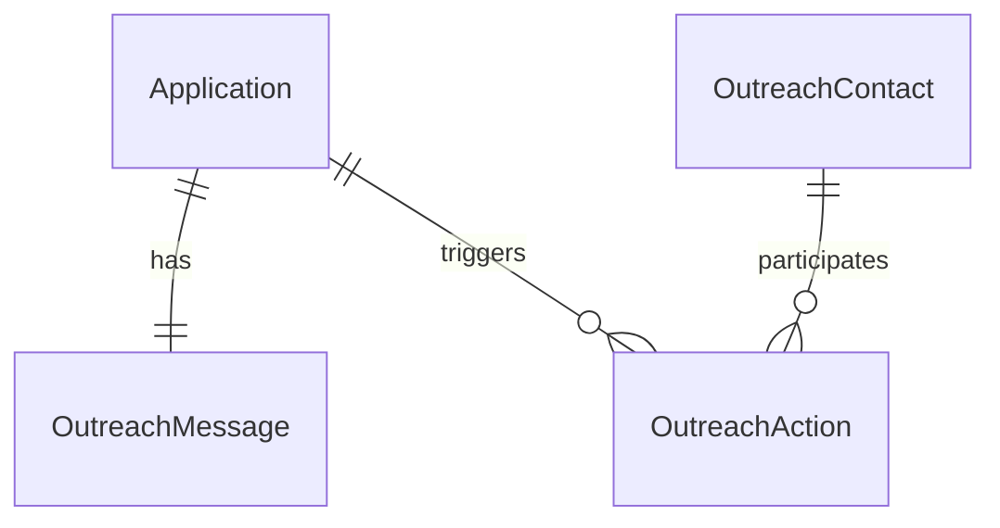

# LinkedIn Outreach Tracking – Design Draft

> _The Void Edition_  
> _/dev/null > outreach – Peer into the corporate abyss_

---

## 1  Core objects & relationships

| Entity | Purpose | Key fields |
|--------|---------|------------|
| **Application** | Existing job-application record | `id`, `company`, `role`, … |
| **OutreachContact** | A human you pinged | `id`, `full_name`, `headline`, `linkedin_url` (unique), `avatar_url`, timestamps |
| **OutreachMessage** | The canned note you paste into LinkedIn (one per application) | `id`, `application_id`, `body` |
| **OutreachAction** | The act of sending a request | `id`, `contact_id`, `application_id ?`, `company`, `message_template_id`, `status`, `sent_at`, `responded_at`, `notes` |

### Cardinalities

* Application **1—1** OutreachMessage  
* Application **0..*** OutreachAction  
* OutreachAction **✱—1** OutreachContact



---

## 2  UX / data-entry scenarios

### A  Reaching out **before** an application exists
1. Quick-add overlay: "Log LinkedIn outreach".
2. Ask for: company, LinkedIn URL(s) (comma-separated), optional message.
3. System parses URLs, creates `OutreachContact` rows (if unknown) and `OutreachAction` rows with `application_id = NULL`.

### B  Reaching out **after** an application exists
Same overlay lives on the application detail page; we already know `application_id` and pre-populate / reuse the application's `OutreachMessage`.

### C  Linking pre-application records later
When a new application is created, backend query:
```sql
UPDATE outreach_action
SET application_id = :new_app_id
WHERE company = :company AND application_id IS NULL;
```
UI prompt: "We found _n_ earlier outreaches to **ACME Corp** – link them?"

---

## 3  Representing a person

* **Mandatory**: LinkedIn URL (globally unique, human-meaningful).
* **Nice-to-have**: parsed name & headline (scraped once with headless browser) or manual entry.
* **Optional**: screenshot drop-in (`avatar_url`). Heavy; skip unless users request.

---

## 4  LinkedIn integration reality-check

* Public/free LinkedIn API basically doesn't exist now.
* If we want auto-metadata, run a server-side headless browser once on creation to pull open-graph tags (name, avatar). Cache forever.
* Everything else stays manual.

---

## 5  Migration sketch (incremental, safe)

| Phase | Goal | Notes |
|-------|------|-------|
| **0  Schema only** | Add the three tables with Drizzle migrations | expose minimal data-access helpers │
| **1  Manual logging UI** | Button on application detail: "Log LinkedIn outreach" | plus stand-alone "Quick Outreach" modal |
| **2  Display** | In application page: list contacts, their status & dates | global "Outreach Inbox" view |
| **3  Polish** | Headless scraping for auto-name/avatar (env-flagged) | drag-and-drop screenshot upload |
| **4  Smart linking** | Auto-link pre-application records using company slug matching | user confirmation |

---

## 6  Open questions

1. Non-LinkedIn channels? (Twitter, email) ⇒ add `channel` enum to `OutreachAction`.
2. Multiple message templates vs. one per application?
3. Response granularity – binary accepted/ignored vs. storing the actual reply text?
4. Screenshots – are they vital? They're heavy and hard to search.
5. GDPR / privacy – we store personal data. Need disclaimer + delete-on-request.

---

## 7  Why this fits The Void™

* "Human outreach" is still job-hunt-adjacent, mentally belongs under an application.
* Zero risk to existing workflows – we only add tables.
* Branding remains on-point:  
  `/dev/null > outreach – No humans have been pinged yet`  
  "Reach further into the corporate void" button.

---

_The Void Awaits._ 